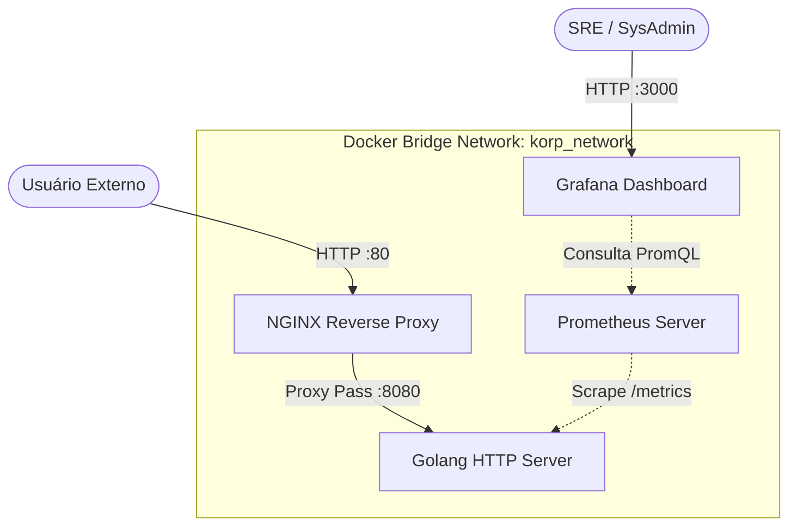

# Desafio DevOps - Infraestrutura Korp


## Visão Geral do Projeto
Este repositório contém a infraestrutura como código (IaC) e o serviço construídos para o Desafio Técnico da Korp. O objetivo principal foi demonstrar a capacidade de desenvolver, conteinerizar, orquestrar, monitorar e automatizar um serviço web moderno, aplicando as melhores práticas de Engenharia de Confiabilidade (SRE) e DevOps.

---

## Arquitetura da Solução
A arquitetura foi desenhada com foco em segurança através do isolamento. O serviço backend (Golang) opera estritamente dentro da rede privada do Docker, sem portas expostas ao host. Todo o tráfego de entrada é gerenciado e roteado por um Proxy Reverso (NGINX).



---

## Decisões Arquiteturais e Boas Práticas
Para garantir um padrão corporativo, as seguintes decisões foram tomadas:

1. **Multi-stage Builds (Docker):** A imagem da aplicação Go foi gerada em duas etapas. Utilizou-se a imagem base do compilador do Go apenas para a geração do binário, transferindo-o em seguida para uma imagem `alpine` ultraleve. **Resultado:** Redução substancial do tamanho da imagem final e diminuição da superfície de ataque (Security Best Practice).
2. **Reverse Proxy Pattern:** Isolamento total do serviço backend. O NGINX lida com a entrada de dados e terminação HTTP, protegendo a aplicação contra acessos indevidos e permitindo futura implementação de SSL/TLS (HTTPS) ou Rate Limiting de forma transparente.
3. **Provisionamento Automatizado de Dashboards (Grafana):** Em vez de configurações manuais no painel via UI, os *Data Sources* e *Dashboards* foram declarados via arquivos de configuração (YAML/JSON). Isso garante reprodutibilidade em qualquer ambiente e segue os princípios de Infrastructure as Code.
4. **Métricas Golden Signals:** A aplicação Go foi instrumentada via `client_golang` para expor métricas críticas, permitindo ao Grafana analisar a Taxa de Requisições e a Disponibilidade (Uptime).

---

## Implantação e Execução

### Pré-requisitos
- Máquina Linux (Ubuntu/Debian recomendado)
- Git instalado
- (Apenas para Automação Total) Ansible instalado na máquina controladora

### Opção 1: Implantação Automatizada (Ansible) - Recomendada
A stack inteira pode ser provisionada através de um único comando. O Playbook garantirá a instalação do ecossistema Docker, copiará o projeto para o diretório de destino (`/opt/projeto-korp`) e realizará o build e orquestração do ambiente.

```bash
cd ansible
ansible-playbook -i inventory.ini playbook.yml -K
```

### Opção 2: Execução Local (Docker Compose)
Para ambientes de desenvolvimento que já possuem o Docker instalado:
```bash
docker compose up --build -d
```

---

## Validação e Observabilidade

- **Testar a API:** `curl http://localhost/projeto-korp` (Retornará um JSON formatado com o nome do projeto e o timestamp em UTC).
- **Acessar Grafana:** Navegue até `http://localhost:3000` (Credenciais padrão: `admin` / `admin`). O dashboard de monitoramento "Projeto Korp" estará carregado automaticamente.
- **Acessar Prometheus:** Navegue até `http://localhost:9090`.

